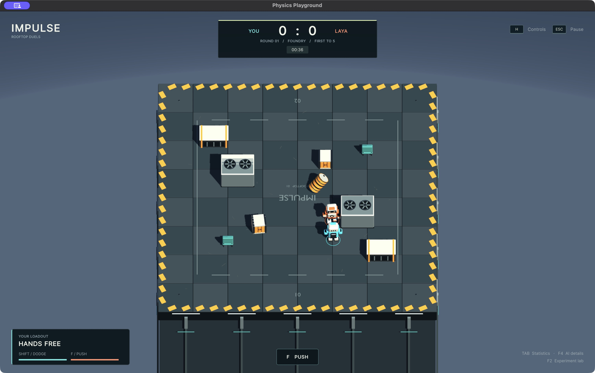
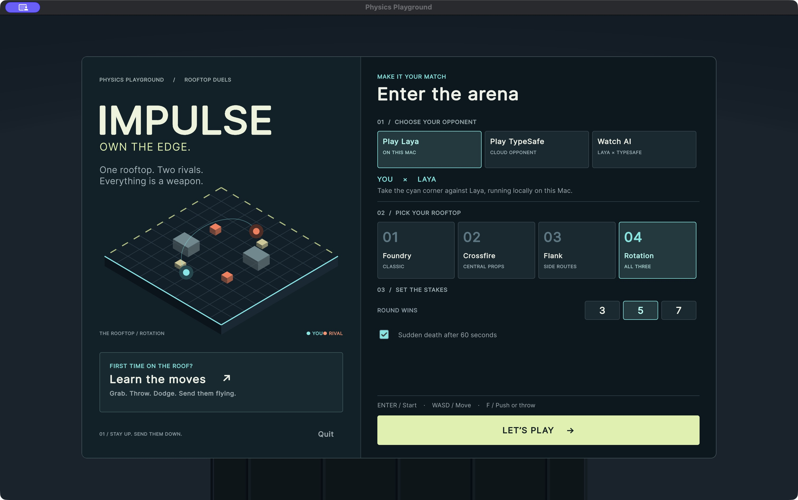

<div align="center">

# IMPULSE

### Let your creativity loose. Put AI decisions into play.

**A physics playground where decision-making models meet on the rooftop.**

Play against AI. Watch models face off. Change the experiment. See what happens next.

[Get started](#get-started) · [Choose your matchup](#choose-your-matchup) · [Experiment with decisions](#experiment-with-decisions) · [Under the hood](#under-the-hood)



*Actual gameplay: human versus local Laya. Built with Unity 6.*

</div>

## One rooftop. Different minds. Real consequences.

What happens when an AI model has to choose its next move with a rival approaching,
a barrel within reach, and the edge just a few steps away?

**IMPULSE** turns that question into a playful robot showdown. Push, dodge, grab,
and throw your way through a physics arena—or let two models take the controls
and watch their decisions unfold. A clever move can win the round. A bad one can
send a robot off the roof.

It's a fun, hands-on way to explore how different decision-making models behave
in the same game, with tools to inspect the choices behind the action.

- **Play or spectate.** Challenge local Laya, face a model through TypeSafe, or watch Laya versus TypeSafe.
- **Make it your experiment.** Adjust instructions, observations, available actions, and decision frequency in the built-in experiment lab.
- **See more than the score.** Inspect action distributions, model responses, inference latency, and recorded matches.
- **Keep the physics shared.** Every fighter uses the same movement, cooldowns, interactions, and combat rules.
- **Bring some chaos.** Three arena layouts, throwable props, first-to-3/5/7 matches, and optional sudden death.

## Choose your matchup

| Mode | Who plays | What you need |
|---|---|---|
| **Play Laya** | You versus local Laya | Local Python setup and downloaded model weights; no API key |
| **Play TypeSafe** | You versus a model available through TypeSafe | A TypeSafe API key and internet access |
| **Watch AI** | Local Laya versus your selected TypeSafe model | Both of the above |



TypeSafe models are discovered from your account in the setup screen. Cloud
requests use your account's allowance. With **Remember key on this Mac** (on by
default) the key is stored in your macOS Keychain and reconnects automatically next
launch; otherwise it stays in session memory. Keys are never written to settings,
recordings or exports. See [TypeSafe setup](TYPESAFE.md).

## Get started

The current build workflow targets **macOS**. The project was validated with
**Unity 6000.4.0f1** and **Python 3.13**. The Mac build targets Apple Silicon and
Intel; local inference uses the Apple GPU when available, with CPU support.
Other platforms have not been validated.

### 1. Get the project

```sh
git clone https://github.com/roby-avo/impulse.git
cd impulse
```

Install Unity **6000.4.0f1** through Unity Hub with Mac build support, Python 3.13,
and Xcode Command Line Tools (`xcode-select --install`) for the native Dock plugin.
The repository contains source and game assets; generated app builds and model
weights are not included.

### 2. Set up local Laya

```sh
./ai/setup.sh
```

This creates a Python environment, installs pinned dependencies, and downloads
the Laya checkpoint. After the initial download, local inference uses cached
weights offline. You can skip this step for TypeSafe-only play.

### 3. Launch

Double-click **Play Physics Playground.command**, or run:

```sh
./Play\ Physics\ Playground.command
```

The launcher builds the Mac app if needed, starts the local Laya service when
installed, and opens the game. Close the Unity editor before the first build.
If Unity lives elsewhere, set `UNITY_EDITOR` to its executable path.

Choose a matchup, select your rooftop, and press **Enter**. Start with
**Learn the moves** for guided, unscored practice.

> **Local Laya starts automatically.** The game starts the installed service when
> a local connection fails, including when you open the built `.app` directly,
> and reconnects after the service stops. Keep the app in this project's `Builds`
> folder so it can find `ai/`. First launch may take a few seconds to load weights.
> If setup is missing, run `./ai/setup.sh` once. Startup diagnostics are saved to
> `ai/.runtime/service.log`. **Stop Local Laya.command** stops the service;
> quit or switch away from local Laya first to prevent the game restarting it.

### Run in the Unity editor

Open this folder in Unity Hub, open `Assets/Scenes/Rooftop.unity`, start
`./ai/start.sh` in a terminal, and press Play.

## Play the game

Knock your rival off the rooftop. There is no health bar: timing, positioning,
and physical impacts decide the round. Fighters automatically face their rival,
and throws aim automatically, so gameplay stays keyboard-only.

| Key | Action |
|---|---|
| **WASD / arrows** | Move |
| **Space** | Jump |
| **Shift** | Dodge |
| **E** | Grab or drop a prop |
| **F** | Push, or throw a held prop |
| **Enter** | Start the selected matchup |
| **Escape** | Pause, change matchup, or adjust graphics and volume |
| **R** (hold) | Start a fresh match |
| **H** | Show controls |
| **Tab** (hold) | Match statistics |
| **F4** | Model diagnostics |
| **F2** | Experiment lab |
| **F3** | Export and inspect a match |

## Experiment with decisions

The arena is also a small laboratory for curiosity. Try changing what a model
can observe, rewriting an action's criteria, or changing the request frequency.
Then inspect whether its choices, timing, and outcomes change.

**F2** opens experiment settings, action and observation schemas, and saved-match
inspection. **F3** exports a match with a sampled spatial replay and per-decision
details. Recordings include offered actions, model outputs, latency, execution,
and outcomes. See [the experiment guide](EXPERIMENTS.md) for data definitions.

**Keep comparisons in context:** this is an experimental game, not a standardized
AI benchmark or a claim about general intelligence. Results depend on the
instructions, observations, arena, model, and inference latency. Laya has not been
fine-tuned for this game and can make repetitive or weak choices. Its confidence
scores are not calibrated for gameplay. The TypeSafe integration has been checked
with a local API contract fixture; live cloud performance is not established by
those tests.

## Under the hood

The loop is straightforward: **observe the arena → ask the model → validate its
chosen action → execute it through the shared fighter controller.**

Laya runs locally using the pinned `laya==0.3.7` SDK and the English
`convaiinnovations/laya` checkpoint. A small HTTP service preloads and warms the
model, runs inference on a dedicated worker, and reports health and timing.
TypeSafe uses its System One API through the same game transport.

Models select semantic actions. Game code handles movement and physical
execution, filters mechanically impossible actions, and rejects stale replies.
Errors produce neutral waiting and retries; another policy never secretly takes
over a model's decisions.

| Area | Location |
|---|---|
| Model transport, perception, and action execution | `Assets/Scripts/AI/` |
| Shared movement and combat | `Assets/Scripts/Characters/` |
| Experiment settings and exports | `Assets/Scripts/Experiments/` |
| Local Laya service and checks | `ai/` |
| Editable Blender assets and generation script | `ArtSource/` |
| Unity validation harnesses | `Assets/Tests/` and `Assets/Editor/` |

Original procedural meshes, synthesized sounds, and UI assets are documented in
[asset provenance](ASSETS.md). Model weights and Unity dependencies retain their
respective licenses and are not bundled in this repository.

## Development and validation

With local Laya running and the Unity editor closed:

```sh
scripts/unity-check.sh Playground.Editor.Validation.M7
scripts/unity-check.sh Playground.Editor.KeyboardGameplayValidationLauncher.Run
scripts/unity-check.sh Playground.Editor.ProjectSetup.BuildMac -quit
```

The repository includes validation reports for [keyboard gameplay](validation/KEYBOARD_GAMEPLAY.md),
[combat](validation/GAMEPLAY_UPGRADE.md), [model decisions](validation/LAYA_DECISION_UPGRADE.md),
[provider matchups](validation/MATCHUPS.md), and [local inference latency](validation/LAYA_LATENCY.md).
These describe the tested configurations and their limitations.

More detail: [local service](ai/README.md) · [experiments](EXPERIMENTS.md) ·
[asset pipeline](ArtSource/README.md) · [development history](DEVELOPMENT_STATUS.md).

---

**Bring your curiosity. Change the decisions. See who stays on the roof.**
